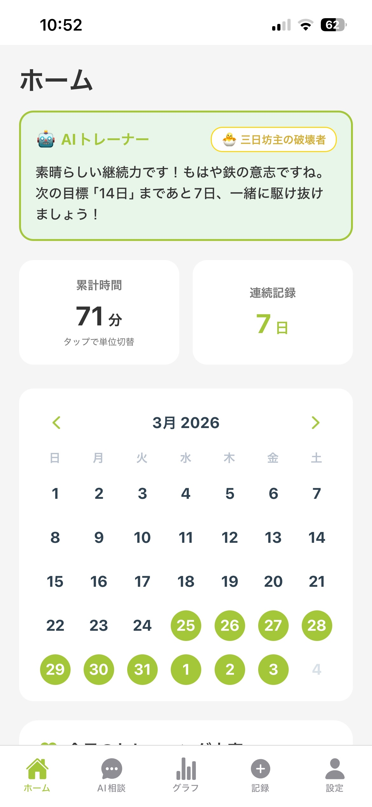
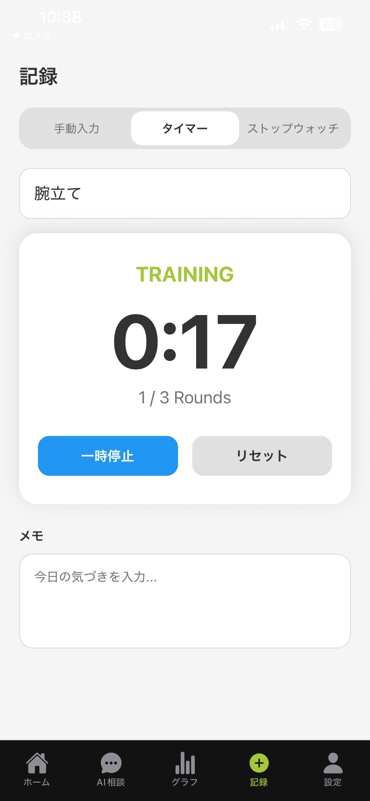
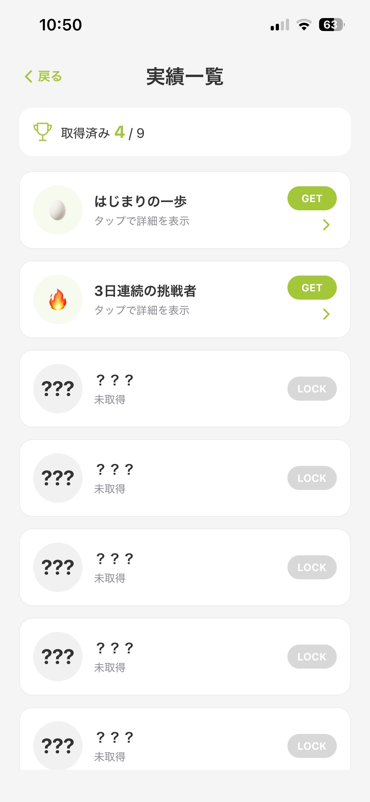
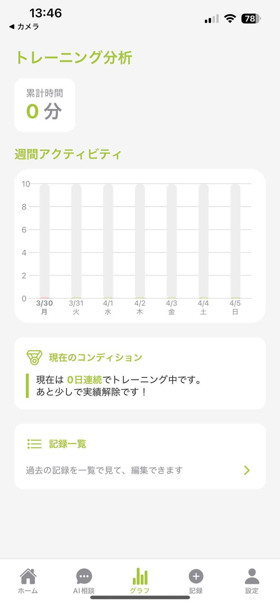
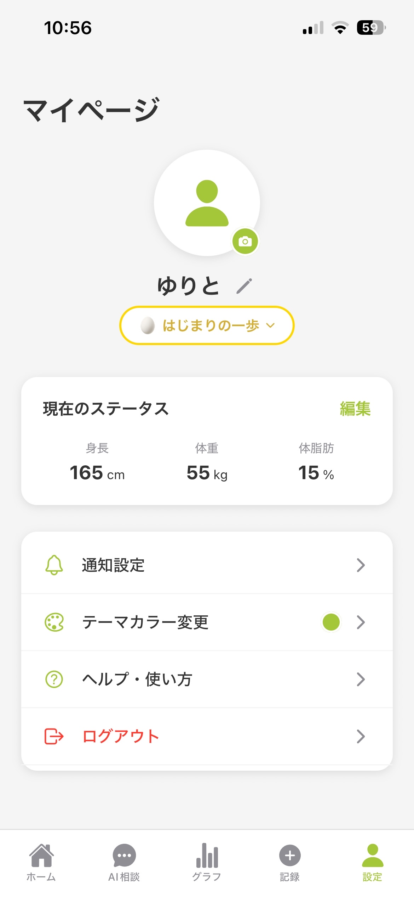

# muscloop

muscloop は、筋トレを続けたい人のための継続支援アプリです。  
記録、AI 相談、実績、通知をひとつのアプリにまとめることで、筋トレ初心者でも迷わず続けやすい体験を目指しました。

2026 年 3 月に開催された `SysHack2026` にて開発し、**サイバーエージェント賞** を受賞しました。

## 受賞実績

- `SysHack2026 サイバーエージェント賞`

審査では、次のような点を評価していただきました。

- デザインや機能、細かい部分まで含めた UI / UX の完成度
- 問題提起から解決策までの流れがわかりやすいこと
- AI とやり取りしながらメニューを決められる体験
- 継続を支える通知や実績など、習慣化を意識した設計

## 背景

筋トレは始めても継続できずに終わってしまうことが多く、チーム内でも同じ悩みがありました。  
そこで muscloop では、単なる記録アプリではなく、**継続のハードルを下げること** に焦点を当てました。

特に次の 3 点を重視しています。

- 何をすればいいか迷わないこと
- 記録の手間が少ないこと
- 続けたくなる仕組みがあること

## 主な機能

- メール / パスワード認証
- ゲスト利用
- 筋トレ記録
- タイマー / ストップウォッチによる記録補助
- ホーム画面での累計時間、連続記録、カレンダー表示
- AI 相談によるメニュー提案
- 実績一覧
- テーマカラー変更
- 通知設定
- プロフィール編集

## 特に見せたいポイント

### 1. AI 相談から記録までを自然につなげたこと

AI に相談してメニューを決め、そのまま記録画面へつなげられるようにしています。  
「考える」から「実行する」までの流れを分断しないことで、行動に移しやすい設計を意識しました。

### 2. 継続を支える UI / UX

ホーム画面では、累計時間、連続記録、カレンダー、AI からのメッセージをまとめて確認できます。  
また、実績やテーマカラー変更など、使い続けたくなる体験も取り入れています。

### 3. 通知を含めた継続支援の導線

Expo Push Token を保存し、FastAPI 側からリマインド通知を送れる構成にしています。  
日々の行動を思い出してもらうための土台として実装しました。

## 画面イメージ

### ホーム

累計時間、連続記録、カレンダー、AI メッセージをひとつの画面で確認できます。



### 記録

手動入力だけでなく、タイマーやストップウォッチを使った記録にも対応しています。



### 実績一覧

取得済みの実績と未取得の実績を一覧で確認できます。



### グラフ

トレーニング状況を可視化し、過去の記録一覧にも移動できます。



### 設定

プロフィール、通知、テーマカラー変更など、継続しやすい体験を支える設定をまとめています。



## 技術スタック

### フロントエンド

- React Native
- Expo
- Expo Router
- TypeScript

### バックエンド

- FastAPI
- Python

### データ / 認証 / 通知

- Firebase Firestore
- Firebase Authentication
- Expo Push Notifications
- APScheduler

## システム構成

```text
React Native (Expo)
  ↓ API リクエスト
FastAPI
  ↓
Firebase Firestore / Firebase Authentication
```

- フロントエンドから FastAPI に API リクエストを送り、ユーザープロフィールや記録を保存・取得
- 認証は Firebase Authentication を利用
- 通知用の Expo Push Token を保存し、バックエンドからリマインド通知を送信

## 開発体制

- 開発期間: 2026/03/17 - 2026/03/31
- ハッカソン: `SysHack2026`
- チーム人数: 5 名
- 開発形態: チーム開発

## 自分の担当

私は **PM 兼バックエンド担当** として、主に次を担当しました。

- API の実装
- フロントエンドとバックエンドの接続
- AI 機能のダミー実装による先行接続
- 実機で動かすための動作確認と進行管理

また、チーム全体の進捗を見ながら、限られた期間の中でどこまで実装するかの優先順位付けも行いました。

## 工夫した点

### 技術面

- まずダミーデータで AI 導線を成立させ、あとから本実装につなげられるようにした
- 画面ごとに個別で処理するのではなく、フロントとバックのデータの流れをそろえて反映のずれを減らした

### UX 面

- 操作回数をできるだけ減らし、思考コストを下げることを意識した
- 記録、AI 相談、実績、通知をばらばらにせず、一連の習慣化体験としてまとめた

### チーム開発面

- 各メンバーの進捗や詰まりを把握し、期間内に完成へ近づけるように役割分担を調整した
- 似た作業が重なってコンフリクトしないよう、担当範囲を整理し直した

## 苦労したこと

### 1. コンフリクト対応

複数人が近い箇所を同時に触る場面があり、コンフリクトの解消に苦労しました。  
そこで、担当範囲をできるだけ明確に分け、作業の重なりを減らしました。

### 2. 環境差分による起動トラブル

メンバーごとに開発環境が異なり、同じ手順でも起動できないことがありました。  
そのため、接続や起動確認を細かく行い、チーム全体で動かせる状態に近づけることを意識しました。

### 3. 文字化けや表示崩れ

途中で文字化けや画面上の不整合が発生し、起動や表示に影響が出ることがありました。  
見た目だけ先に直すのではなく、まず動作に必要な部分から安定させるように進めました。

## 今後の改善

- AI 機能の精度向上
- AI 画像認識機能の追加
- Android を含む複数環境での安定動作確認
- 通知や認証周りの本番運用を見据えた改善
- アーキテクチャや設計面の整理

## セットアップ

### 1. 必要なもの

- Git
- Node.js / npm
- Python 3.x
- Firebase の `serviceAccountKey.json`

### 2. リポジトリの取得

```bash
git clone https://github.com/gamutegamute/muscle-hackathon.git
cd muscle-hackathon
```

### 3. バックエンド

```bash
cd backend
python -m venv venv
venv\Scripts\activate
pip install -r requirements.txt
copy .env.example .env
```

`backend/.env` に `GEMINI_API_KEY` を設定し、`backend/serviceAccountKey.json` を配置してください。

起動:

```bash
uvicorn app.main:app --reload
```

### 4. フロントエンド

```bash
cd frontend
copy .env.example .env
npm install
npx expo start
```

`frontend/.env` の `EXPO_PUBLIC_API_BASE_URL` は、実機検証時は PC のローカル IP に合わせて変更してください。

例:

```env
EXPO_PUBLIC_API_BASE_URL=http://192.168.1.10:8000
```

## 補足

- Google ログインは今後対応予定です
- 通知は基盤実装済みで、development build 環境での安定確認を予定しています
- 本リポジトリは継続開発中です
